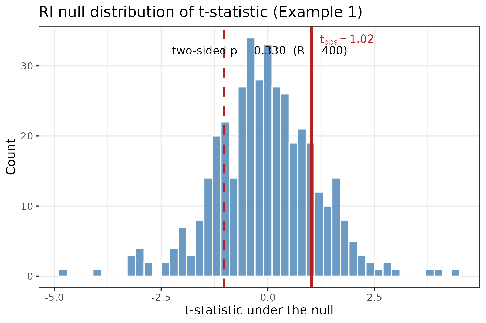
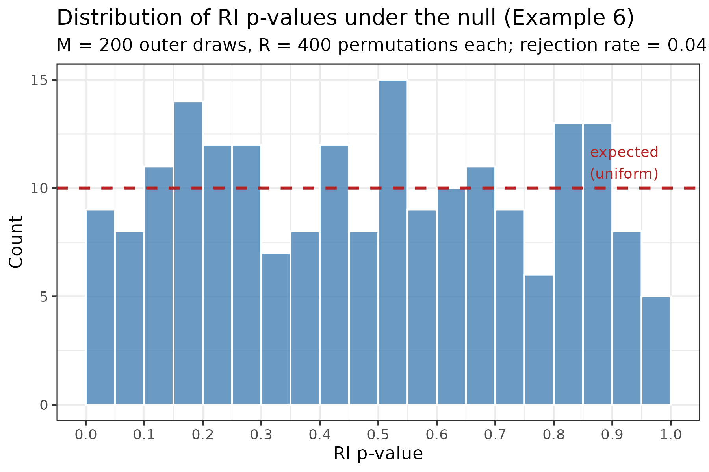

# RI — Randomization Inference

Defines `ri()`, a general-purpose function for randomization inference (RI).
Permutations are supplied by the caller rather than generated internally, so the
function is agnostic to the permutation scheme (within-block, restricted, etc.)
and results are fully reproducible without setting a seed inside `ri()`.

---

## Signature

```r
ri(df, model, tx, T0, id,
   stat = 't', R = NULL, n.cores = NULL, lean = TRUE)
```

### Required arguments

| Argument | Type | Description |
|---|---|---|
| `df` | `data.frame` / `data.table` | Estimation dataset. Must contain the outcome, treatment variable(s) named in `tx`, and the ID column named in `id`. |
| `model` | function **or** quoted call | See [Model interface](#model-interface). |
| `tx` | character vector | Treatment variable name(s). Must exactly match `names(T0)`. |
| `T0` | named list **or** `data.frame` | One element per treatment variable. Each element is a `data.frame` or `data.table` with one ID column (matching `id`) and R permutation columns. Row order need not match `df` — rows are aligned internally. When `tx` has exactly one element, `T0` may be supplied as a bare `data.frame` / `data.table` (without wrapping in a list); `ri()` names it automatically. |
| `id` | character string **or** character vector | Name(s) of the identifier column(s). No default. A single string applies the same ID column to every element of `T0`. A character vector of `length(tx)` supplies one ID column name per treatment — use this for mixed-granularity designs, e.g. `id = c(t1 = "unit_id", t2 = "cluster_id")` when one treatment is individually assigned and another is cluster-assigned. The vector may be unnamed (positional, matched to `tx` in order) or named (names must match `tx`). `df` must contain all referenced ID columns. |

### Optional arguments

| Argument | Default | Description |
|---|---|---|
| `stat` | `'t'` | Test statistic. `'t'` (default) = Chung–Romano studentised RI: the SE is re-estimated on every permutation, making the statistic approximately pivotal under the null. Requires `fit$se` (fixest) or `vcov()`. Use `cluster =` in the model to cluster at the randomisation unit. `'b'` = raw coefficient; faster, but equivalent in p-value to a fixed-denominator t (dividing all draws by a constant does not change ranks). Use `'b'` only when speed is critical and the SE is expected to be stable across permutations. Custom: `function(fit)` returning a numeric scalar (or vector if `length(tx) > 1`). |
| `R` | `NULL` | Number of permutations to use. Defaults to all columns available in `T0`. Must not exceed the number of permutation columns. |
| `n.cores` | `NULL` | Worker count. `NULL` = auto-detect (reads `SLURM_CPUS_PER_TASK` first, then `detectCores() - 1`). `1L` = serial (plain `lapply`, no overhead). |
| `lean` | `TRUE` | When `TRUE` and `stat` is `'b'` or `'t'`, `ri()` injects `lean = TRUE` (and `nthreads = 1L` when `n.cores > 1`) into any unqualified `feols()`, `fepois()`, or `feglm()` call inside the model, suppressing allocation of large internal objects at fit-construction time and preventing CPU oversubscription when outer parallelism is active. Set `FALSE` when using a custom `stat` function that needs model-matrix data, or when calling estimators with a namespace qualifier (which bypasses injection). |

---

## Model interface

Two calling conventions are supported:

**Function (recommended)**

```r
model = function(df) feols(y ~ x | fe, cluster = ~cl, data = df)
```

The function receives the (possibly permuted) data frame and returns a fitted model
object. Any estimation function that returns an object supporting `coef()` works.
For `stat = 't'`, the object must also support `$se` (fixest) or `vcov()`.

When `lean = TRUE` (default), `ri()` automatically injects `lean = TRUE` into
unqualified `feols()` calls — no need to include it in the model function. For
`stat = 'b'`, `only.coef = TRUE` is also injected, skipping SE computation
entirely. User-supplied values for either argument are respected and not overridden.

**Quoted call**

```r
model = quote(feols(y ~ x | fe, cluster = ~cl, data = df))
```

The call is evaluated with `df` bound to the current (possibly permuted) data frame.
The literal name `df` must appear as the `data` argument. This convention is
convenient for interactive use and is compatible with any expression that can be
`eval()`-ed.

> **Windows / socket cluster note**: when `n.cores > 1` on Windows, `ri()` creates
> a PSOCK socket cluster. Workers are fresh R sessions; required packages must be
> loaded inside the model function (e.g. `function(df) { library(fixest); feols(...) }`)
> or via a prior `parallel::clusterEvalQ()` call.

---

## Return value

A named list:

| Element | Description |
|---|---|
| `teststat` | Observed test statistic (length `length(tx)`). |
| `testdist` | `R × length(tx)` matrix of permutation-draw test statistics. |
| `p.left` | Left-tail RI p-value per treatment. |
| `p.right` | Right-tail RI p-value per treatment. |
| `p` | Two-sided RI p-value: `min(2 · min(p.left, p.right), 1)`. |

---

## Parallelism

| Setting | Backend | Notes |
|---|---|---|
| `n.cores = 1L` | `lapply` | Serial; no overhead. |
| `n.cores > 1`, Linux / macOS | `parallel::mclapply` | Fork-based; workers inherit the parent session via copy-on-write. Large objects (e.g. `T0`) are not copied unless written. Correct behaviour inside a SLURM job with `--cpus-per-task N`. |
| `n.cores > 1`, Windows | `parallel::parLapply` | PSOCK socket cluster; required objects exported automatically. |

**SLURM usage**: request cores with `#SBATCH --cpus-per-task N` and leave
`n.cores = NULL`. The function reads `SLURM_CPUS_PER_TASK` automatically.

---

## Performance

Two complementary optimisations apply automatically for `stat = 'b'` and `stat = 't'`
(disabled for custom stat functions, which may need the full fit):

**Pre-estimation injection (`lean = TRUE`, default):** `ri()` shadows any
unqualified `feols()`, `fepois()`, or `feglm()` call in the model with a
wrapper that injects:
- `lean = TRUE` — suppresses allocation of the score matrix, fitted values, and
  residuals at fit-construction time (the deeper saving; applies to all three estimators).
- `only.coef = TRUE` — (`stat = 'b'` only) skips SE computation entirely,
  returning a named numeric vector rather than a full fit object.
- `nthreads = 1L` — (when `n.cores > 1`) disables within-estimator threading to
  prevent CPU oversubscription when `ri()` is already dispatching across
  permutations via `mclapply` / `parLapply`.

Set `lean = FALSE` to disable all injections. Does not intercept
namespace-qualified calls (`fixest::feols()`, `fixest::fepois()`, etc.).

**Post-fit stripping (always active):** after each fit is returned, `ri()` also
nulls the same large fields as a safety net, covering calls that used
`fixest::feols()` directly or where `lean = FALSE` was passed.

**`stat = 'b'` vs `stat = 't'`:** the default `'t'` re-estimates the SE on every
permutation draw (Chung–Romano studentised RI), giving better size properties at
the cost of a `vcov` computation per iteration. `stat = 'b'` gives the same p-value
as a fixed-denominator t-statistic — dividing every draw by the observed SE is a
constant scaling that does not change ranks. Use `'b'` only when speed is critical
and the SE is expected to be stable across permutations.

---

## Examples

### Minimal example (function interface)

```r
source("Analysis/lib/RI/ri.R")

result <- ri(
    df    = my_data,
    model = function(df) feols(y ~ cash | neighborhood, cluster = ~neighborhood,
                               data = df),
    tx    = "cash",
    T0    = list(cash = W0_cash),   # data.frame: study_id + w_1 ... w_R
    id    = "study_id"
)

cat("RI p-value:", result$p, "\n")
```

### Quoted call interface

```r
result <- ri(
    df    = my_data,
    model = quote(feols(y ~ cash | neighborhood, cluster = ~neighborhood, data = df)),
    tx    = "cash",
    T0    = list(cash = W0_cash),
    id    = "study_id"
)
```

### Custom test statistic

```r
#  Use the F-statistic for a joint test
result <- ri(
    df    = my_data,
    model = function(df) feols(y ~ cash + equity | nb, cluster = ~nb, data = df),
    tx    = c("cash", "equity"),
    T0    = list(cash = W0_cash, equity = W0_equity),
    id    = "study_id",
    stat  = function(fit) fitstat(fit, "f")$f$stat
)
```

### Serial execution (e.g. for debugging)

```r
result <- ri(..., n.cores = 1L)
```

### Subset of available permutations

```r
#  T0 has 2000 columns but use only 500 for a quick check
result <- ri(..., R = 500L)
```

---

## Example script (`example.R`)

`example.R` is a self-contained vignette using synthetic data (N = 300 units,
K = 10 clusters, R = 400 permutations). Source `ri.R` first, then run it
interactively. It requires `fixest`, `ggplot2`, and `tictoc`.

The script walks through nine examples in sequence:

| Example | What it demonstrates |
|---|---|
| 1 | Function interface; default `stat = 't'`; null distribution plot |
| 2 | Quoted call interface; confirms identical result to Example 1 |
| 3 | `stat = 'b'`; bare `data.frame` shorthand for `T0` |
| 4 | Custom `stat` function extracting t-value from an ANCOVA model |
| 5 | Using a subset of available permutations (`R = 100`) |
| 6 | Null rejection rate over M = 200 outer draws; p-value distribution plot |
| 7 | Two independent treatments; `T0` as a named list; joint F-stat |
| 8 | Interaction `t*x`; only `t` in `T0`; interaction rebuilt by formula on each draw; Wald joint test |
| 9 | Poisson QMLE (`fepois`) for a non-negative count outcome; comparison with `feols` on IHS; lean injection applies automatically |

Each example is wrapped in `tictoc::tic()` / `toc()` so run times are printed
alongside results.

### Example 1 — null distribution of the t-statistic

The histogram shows the distribution of the t-statistic across all R
permutations under the sharp null of no effect. The solid red vertical line
marks the realised t-statistic from the observed assignment; the dashed line
marks its negative (the symmetric rejection region for a two-sided test). The
fraction of permutation draws falling beyond either line equals the two-sided
RI p-value.



### Example 6 — p-value distribution under the null

Each of the M = 200 outer draws generates a fresh outcome vector with no
treatment effect (α = 0) and runs a full RI test. The histogram of the
resulting p-values should be approximately Uniform(0, 1). The dashed red line
marks the expected count per bin under a true uniform distribution; a flat
histogram confirms that the procedure is correctly sized at the nominal level.



---

## T0 format

Each element of `T0` must be a `data.frame` (or `data.table`) with:

- **One ID column** whose name matches the `id` argument.
- **R permutation columns** — one column per draw, in any column order. Column
  names are arbitrary (e.g. `w_1`, `w_2`, …). Values should be the permuted
  treatment indicator (typically integer 0/1).

Row order need not match `df`; `ri()` aligns rows via the ID column before
estimation begins.

**Single-treatment shorthand:** when `tx` is a length-1 character vector, `T0`
may be supplied as a bare `data.frame` / `data.table` rather than a
`list(tx_name = ...)` wrapper:

```r
# These two calls are equivalent:
ri(..., tx = "cash", T0 = list(cash = W0_cash), ...)
ri(..., tx = "cash", T0 = W0_cash,              ...)
```

For multiple treatment variables, `T0` must be a named list with one element
per element of `tx`.

Example layout for `T0[["cash"]]` with `id = "study_id"` and R = 3:

| study_id | w_1 | w_2 | w_3 |
|---|---|---|---|
| 1001 | 1 | 0 | 0 |
| 1002 | 0 | 1 | 1 |
| 1003 | 1 | 1 | 0 |
